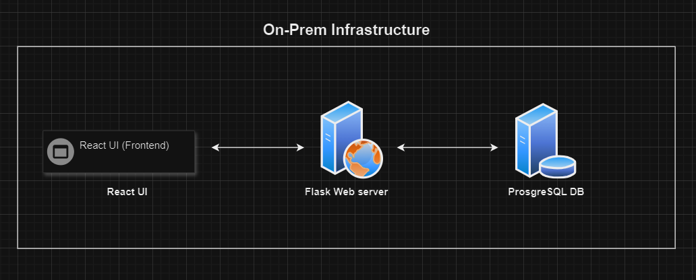
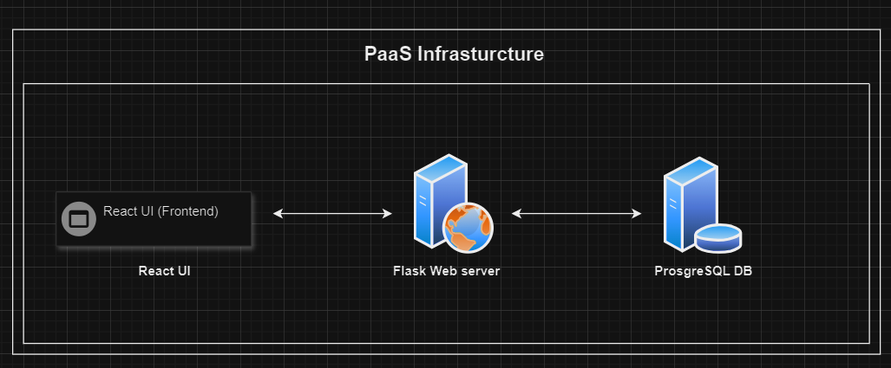
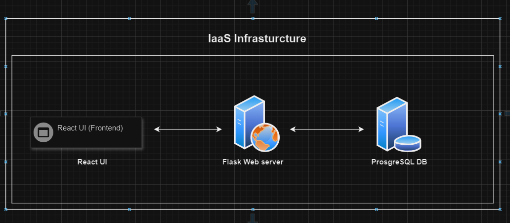

# On-Premises to Cloud Deployment

## On-Premises Overview

On-premises refers to IT infrastructure hardware and software applications that are hosted on-site. This contrasts with IT assets that are hosted by a public cloud platform or remote data center. Businesses have more control of on-premises IT assets by maintaining performance, security, upkeep, and physical location.

Many legacy and traditional data center resources are on-premises. There has been a shift to migrate IT assets to the cloud in recent years or to create hybrid environments that use a mix of cloud and on-premises solutions.

The diagram above demonstrates an on-premises setup consisting of a Web Server written in Flask, a UI frontend written in React, and a database layer consisting of PostgreSQL.

### Components

- **Flask**: A lightweight Python web framework that allows you to build web applications. It’s minimalistic, flexible, and great for small to medium-sized projects. Flask is used to handle HTTP requests, routing, and serve your React frontend.

- **React**: A popular JavaScript library for building user interfaces. It allows you to create dynamic, single-page applications (SPAs) efficiently. React is responsible for rendering the user interface, handling user interactions, and communicating with the Flask backend.

- **PostgreSQL**: A powerful open-source relational database management system known for its robustness, extensibility, and support for complex queries. PostgreSQL is used to store and manage your application’s data.

## On-Prem to PaaS Deployment

Platform as a Service (PaaS) is a complete development and deployment environment in the cloud, with resources that enable you to deliver everything from simple cloud-based apps to sophisticated, cloud-enabled enterprise applications. You purchase the resources you need from a cloud service provider on a pay-as-you-go basis and access them over a secure Internet connection.

### Azure Cloud Deployment Description

1. **React Application**: Deployed using Azure Static Web Apps, which serves static content efficiently.
2. **Flask API**: Deployed using Azure App Service, which allows you to host web applications and APIs.
3. **PostgreSQL Database**: Managed using Azure Database for PostgreSQL, a fully managed database service.

### Components

1. **Azure Static Web Apps (React UI)**:
   - Serves your React application as static files, automatically handling the distribution and scaling.
   - Supports easy integration with GitHub for CI/CD.

2. **Azure App Service (Flask API)**:
   - A fully managed service for hosting web applications and APIs.
   - Scales automatically based on traffic, allowing for quick deployments and updates.

3. **Azure Database for PostgreSQL**:
   - A fully managed PostgreSQL database service that provides automatic backups, scaling, and security.
   - Ensures high availability and durability for your data.

### Flow

1. Users access the React UI hosted on Azure Static Web Apps, served over HTTPS.
2. The React app communicates with the Flask API deployed on Azure App Service through RESTful API calls.
3. The Flask API interacts with the Azure Database for PostgreSQL to perform data operations.

### Benefits of Using Azure PaaS

- **Managed Services**: Focus on development without worrying about infrastructure management.
- **Scalability**: Automatically scale resources based on user demand.
- **Security**: Built-in security features, including network isolation and data encryption.
- **Integration**: Easy integration with other Azure services for monitoring, logging, and analytics.

## On-Prem to IaaS Deployment

Infrastructure as a Service (IaaS) is a type of cloud computing service that offers essential compute, storage, and networking resources on demand, on a pay-as-you-go basis. IaaS is one of the four types of cloud services, along with Software as a Service (SaaS), Platform as a Service (PaaS), and serverless.

Migrating your organization's infrastructure to an IaaS solution helps you reduce maintenance of on-premises data centers, save money on hardware costs, and gain real-time business insights. IaaS solutions give you the flexibility to scale your IT resources up and down with demand. They also help you quickly provision new applications and increase the reliability of your underlying infrastructure.

IaaS lets you bypass the cost and complexity of buying and managing physical servers and datacenter infrastructure. Each resource is offered as a separate service component, and you only pay for a particular resource for as long as you need it. A cloud computing service provider like Azure manages the infrastructure, while you purchase, install, configure, and manage your own software—including operating systems, middleware, and applications.

### Azure Cloud IaaS Deployment Description

1. **Virtual Machines**: Provision separate VMs for the React application, Flask API, and PostgreSQL database.
2. **Networking**: Set up a Virtual Network (VNet) to ensure secure communication between the VMs.
3. **Storage**: Use Azure Disks for persistent storage and backups as needed.

### Components

1. **VM 1 (React UI)**:
   - Hosts the React application, typically served using a web server like Nginx or Apache.
   - Configured to handle HTTPS traffic to ensure secure communication.

2. **VM 2 (Flask API)**:
   - Hosts the Flask application, typically run with a WSGI server like Gunicorn or uWSGI.
   - Exposes a RESTful API for the React frontend to interact with.

3. **VM 3 (PostgreSQL Database)**:
   - Hosts the PostgreSQL database, configured for data persistence and secure access.
   - Communicates with the Flask API over a private network for enhanced security.

### Flow

1. Users access the React UI hosted on VM 1, served over HTTPS.
2. The React application sends API requests to the Flask API hosted on VM 2.
3. The Flask API communicates with the PostgreSQL Database on VM 3 to perform data operations.

### Benefits of Using Azure IaaS

- **Full Control**: Complete control over the server configuration and software stack.
- **Customizability**: Ability to customize the environment and install necessary dependencies.
- **Scalability**: Can scale by adding more VMs or upgrading existing ones based on traffic and performance needs.
